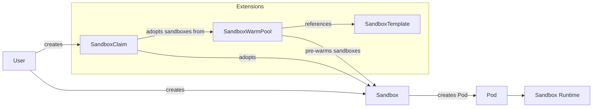
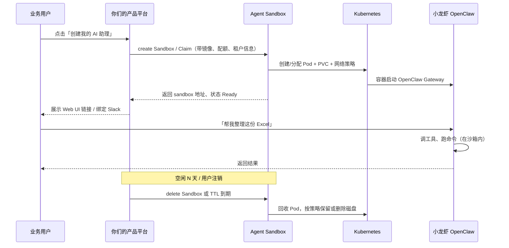

<div align="center">
  

  <h1>Agent Sandbox</h1>
</div>


<p>
  <a href="https://github.com/kubernetes-sigs/agent-sandbox/releases"></a>
  <a href="LICENSE"></a>
  <a href="https://goreportcard.com/report/sigs.k8s.io/agent-sandbox"></a>
</p>

[Website](https://agent-sandbox.sigs.k8s.io) · [Docs](https://agent-sandbox.sigs.k8s.io/docs/) · [DeepWiki](https://deepwiki.com/kubernetes-sigs/agent-sandbox) · [Getting Started](https://agent-sandbox.sigs.k8s.io/docs/getting_started/) · [Examples](examples/) · [Roadmap](roadmap.md)

**agent-sandbox enables easy management of isolated, stateful, singleton workloads, ideal for use cases like AI agent runtimes.**

This project is developing a `Sandbox` Custom Resource Definition (CRD) and controller for Kubernetes, under the umbrella of [SIG Apps](https://github.com/kubernetes/community/tree/master/sig-apps). The goal is to provide a declarative, standardized API for managing workloads that require the characteristics of a long-running, stateful, singleton container with a stable identity, much like a lightweight, single-container VM experience built on Kubernetes primitives.

## Overview

### Core: Sandbox

The `Sandbox` CRD is the core of agent-sandbox. It provides a declarative API for managing a single, stateful pod with a stable identity and persistent storage. This is useful for workloads that don't fit well into the stateless, replicated model of Deployments or the numbered, stable model of StatefulSets.

Key features of the `Sandbox` CRD include:

*   **Stable Identity:** Each Sandbox has a stable hostname and network identity.
*   **Persistent Storage:** Sandboxes can be configured with persistent storage that survives restarts.
*   **Lifecycle Management:** The Sandbox controller manages the lifecycle of the pod, including creation, scheduled deletion, pausing and resuming.

### Extensions

The `extensions` module provides additional CRDs and controllers that build on the core `Sandbox` API to provide more advanced features.

*   `SandboxTemplate`: Provides a way to define reusable templates for creating Sandboxes, making it easier to manage large numbers of similar Sandboxes.
*   `SandboxClaim`: Allows users to create Sandboxes from a `SandboxWarmPool`, abstracting away the details of the underlying Sandbox configuration.
*   `SandboxWarmPool`: Manages a pool of pre-warmed Sandboxes that can be quickly allocated to users, reducing the time it takes to get a new Sandbox up and running.

## Architecture

agent-sandbox follows the Kubernetes controller pattern. Users create a Sandbox custom resource, and the controller manages the underlying runtime resources.

### Architecture Diagram



## Installation

### Core Components & Extensions

You can install the agent-sandbox controller and its CRDs with the following command.

```sh
# Replace "vX.Y.Z" with a specific version tag (e.g., "v0.1.0") from
# https://github.com/kubernetes-sigs/agent-sandbox/releases
export VERSION="vX.Y.Z"

# To install only the core components:
kubectl apply -f https://github.com/kubernetes-sigs/agent-sandbox/releases/download/${VERSION}/manifest.yaml

# To install the extensions components:
kubectl apply -f https://github.com/kubernetes-sigs/agent-sandbox/releases/download/${VERSION}/extensions.yaml
```

### Python SDK

To interact with the agent-sandbox programmatically, you can use the Python SDK. This client library provides a high-level interface for creating and managing sandboxes.

For detailed installation and usage instructions, please refer to the [Python SDK README](clients/python/agentic-sandbox-client/README.md).

## Configuration

For advanced scale and concurrency tuning (e.g., API QPS and worker counts), please see the [Configuration Guide](docs/configuration.md).

## Getting Started

Once you have installed the controller, you can create a simple Sandbox by applying the following YAML to your cluster:

```yaml
apiVersion: agents.x-k8s.io/v1beta1
kind: Sandbox
metadata:
  name: my-sandbox
spec:
  podTemplate:
    spec:
      containers:
      - name: my-container
        image: <IMAGE>
```

This will create a new Sandbox named `my-sandbox` running the image you specify. You can then access the Sandbox using its stable hostname, `my-sandbox`.

For more complex examples, including how to use the extensions, please see the [examples/](examples/) and [extensions/examples/](extensions/examples/) directories.

## Motivation

Kubernetes excels at managing stateless, replicated applications (Deployments) and stable, numbered sets of stateful pods (StatefulSets). However, there's a growing need for an abstraction to handle use cases such as:

*   **Development Environments:** Isolated, persistent, network-accessible cloud environments for developers.
*   **AI Agent Runtimes:** Isolated environments for executing untrusted, LLM-generated code.
*   **Notebooks and Research Tools:** Persistent, single-container sessions for tools like Jupyter Notebooks.
*   **Stateful Single-Pod Services:** Hosting single-instance applications (e.g., build agents, small databases) needing a stable identity without StatefulSet overhead.

While these can be approximated by combining StatefulSets (size 1), Services, and PersistentVolumeClaims, this approach is cumbersome and lacks specialized lifecycle management like hibernation.

## Desired Sandbox Characteristics

We aim for the Sandbox to be vendor-neutral, supporting various runtimes. Key characteristics include:

*   **Strong Isolation:** Supporting different runtimes like gVisor or Kata Containers to provide enhanced security and isolation between the sandbox and the host, including both kernel and network isolation. This is crucial for running untrusted code or multi-tenant scenarios.
*   **Deep hibernation:** Saving state to persistent storage and potentially archiving the Sandbox object.
*   **Automatic resume:** Resuming a sandbox on network connection.
*   **Efficient persistence:** Elastic and rapidly provisioned storage.
*   **Memory sharing across sandboxes:** Exploring possibilities to share memory across Sandboxes on the same host, even if they are primarily non-homogeneous. This capability is a feature of the specific runtime, and users should select a runtime that aligns with their security and performance requirements.
*   **Rich identity & connectivity:** Exploring dual user/sandbox identities and efficient traffic routing without per-sandbox Services.
*   **Programmable:** Encouraging applications and agents to programmatically consume the Sandbox API.

## Roadmap

The current Roadmap can be found at [roadmap.md](roadmap.md).

## Community, Discussion, Contribution, and Support

This is a community-driven effort, and we welcome collaboration!

**Note on PR Velocity:** To maintain high velocity and keep our queues clean, this project uses stale PR management (30-day auto-stale and 15-day auto-close for inactive PRs) and allows maintainers to fast-track or take over approved community PRs. Please read our [Contributing Guidelines](CONTRIBUTING.md) for our full code review and PR policies.

### AI-Assisted Code Reviews (Experimental)

To help improve our review velocity, we are currently experimenting with AI-assisted code reviews using GitHub Copilot and CodeRabbit as our automated first-pass reviewers. Here is the workflow:

1. Copilot and CodeRabbit will automatically review open PRs (skipping draft PRs and PRs without a signed CLA).
1. After automated reviews are posted, the PR will be labeled `action-required: resolve-copilot-comments`.
   * **⚠️ Important Contribution Note (CLA Requirement):** If you receive a code suggestion from Copilot or CodeRabbit in your PR, please don't directly apply suggestions via the GitHub UI. It will set the AI bot as co-author and break the Kubernetes CLA requirements. For more information, read our [Contributing Guidelines](CONTRIBUTING.md). 
1. **Interacting with AI Reviewers:**
   * **GitHub Copilot:** If your organization or account has Copilot enabled, you can interact with Copilot directly in PR comment threads by tagging `@copilot` or clicking the Copilot sparkle icon to ask questions, explain code, or suggest fixes.
   * **CodeRabbit:** CodeRabbit provides high-level summaries and walkthroughs, and acts as an automated gatekeeper that approves the PR once all issues are resolved. You can interact with it by commenting `@coderabbitai` on your PR (e.g., `@coderabbitai review` to request an incremental re-review, or `@coderabbitai full review` to re-evaluate the entire PR from scratch).
1. After automated review comments are addressed or marked resolved, the PR will be labeled `ready-for-review`.
1. Maintainers will review `ready-for-review` PRs and provide final approval.

We actively welcome your feedback on the quality, relevance, and helpfulness of these automated reviews! As we iterate on this process, we also plan to evaluate and test different AI review tools to find the best fit for our project's workflow.

### Contact Us

Learn how to engage with the Kubernetes community on the [community page](http://kubernetes.io/community/).

You can reach the maintainers of this project at:

- [#agent-sandbox Slack channel](https://kubernetes.slack.com/messages/agent-sandbox)
  - If it's your first time joining the Kubernetes Slack, visit https://slack.k8s.io/ to get an invitation.
  - Log in to [Kubernetes Slack](https://kubernetes.slack.com/) first before joining the channel.
- [#sig-apps Slack channel](https://kubernetes.slack.com/messages/sig-apps) for general sig-apps discussions
- [SIG Apps Mailing List](https://groups.google.com/a/kubernetes.io/g/sig-apps)

Please feel free to open issues, suggest features, and contribute code!

### Code of conduct

Participation in the Kubernetes community is governed by the [Kubernetes Code of Conduct](code-of-conduct.md).

[owners]: https://git.k8s.io/community/contributors/guide/owners.md
[Creative Commons 4.0]: https://git.k8s.io/website/LICENSE


# 从业务视角看：业务要用「小龙虾」（OpenClaw）时，Agent Sandbox 在干什么？

> 本文从业务语言解释 [kubernetes-sigs/agent-sandbox](https://github.com/kubernetes-sigs/agent-sandbox) 与 OpenClaw（社区俗称「小龙虾」）的关系，不涉及 Controller 源码细节。
>
> 官方 OpenClaw 用例：[Agents in Sandbox — OpenClaw](https://agent-sandbox.sigs.k8s.io/docs/use-cases/openclaw/)

---

## 1. 业务真正想要什么？

当业务说「我们要给团队/客户上小龙虾」，背后通常是这几件事：

| 业务诉求 | 白话 |
|----------|------|
| **能干活** | 用户发消息 → Agent 调工具、跑命令、改文件、调 API |
| **要在线** | 不是问一句答一句，而是 **7×24 的助理**，状态要保留 |
| **要隔离** | A 部门的小龙虾不能动 B 部门的文件；跑不可信代码不能影响宿主机 |
| **要可控** | 谁能用、能用多久、能访问哪些网、花多少资源 |
| **要快** | 用户点「创建」后，几秒内就能用，不能等 5 分钟拉镜像 |
| **要省钱** | 没人用时能休眠/回收，不能每人一台常驻 VM |

**Agent Sandbox 的定位：** 它不是小龙虾本身，而是 **「给每只小龙虾分配一个安全、有状态、可管理的房间（运行环境）」** 的 K8s 基础设施层。

```
业务产品层：  小龙虾 OpenClaw（Agent 逻辑、工具、对话）
                    ↓ 跑在里面
Agent Sandbox：  隔离房间（Pod + 磁盘 + 网络 + 生命周期）
                    ↓ 跑在上面
Kubernetes：     集群（调度、存储、网络、配额）
```

---

## 2. 两种典型业务模式

agent-sandbox 对应小龙虾，主要有 **两种用法**（业务场景不同）：

### 模式 A：「养一只长期在线的小龙虾」（Always-on）

**适合：** 每个用户/团队一只专属 Agent，像私人助理，要记上下文、挂 Slack、有 Web UI。

**业务体验：**

- 平台给张三创建一只「张三的小龙虾」
- 张三通过 Web UI 或 Slack 一直跟它说话
- 重启、扩节点后，配置和数据还在

**Agent Sandbox 怎么做：**

1. 平台（或运维）创建一个 `Sandbox` CR，镜像里跑 OpenClaw
2. Controller 在 K8s 里拉起 **一个 Pod**，挂载 **持久盘（PVC）**
3. 分配 **稳定身份**（固定 hostname，方便路由和访问）
4. OpenClaw Gateway（如 18789 端口）对外提供 Web/CLI
5. 需要更强隔离时，Pod 用 **gVisor/Kata** 跑（官方示例支持）

业务侧 YAML 概念上就是这样（简化）：

```yaml
apiVersion: agents.x-k8s.io/v1beta1
kind: Sandbox
metadata:
  name: zhangsan-openclaw    # 张三的小龙虾「房间号」
spec:
  podTemplate:
    spec:
      containers:
      - name: openclaw
        image: ghcr.io/openclaw/openclaw:2026.3.23
        # 持久化：对话、配置、工作区文件
      # runtimeClassName: gvisor   # 可选：更强隔离
```

**业务看到的结果：** 一只稳定在线的小龙虾，有地址、有 Token、有磁盘，不用自己管 Pod 怎么建。

---

### 模式 B：「临时叫一只小龙虾干完活就走」（Claim + WarmPool）

**适合：** 大量用户偶尔用、或 Agent 要 **执行一段不可信代码**（写代码、跑脚本），用完即毁。

**业务体验：**

- 用户在平台点「运行任务」
- 几百毫秒内分配到环境
- 任务结束自动销毁，或 TTL 到期回收

**Agent Sandbox 怎么做：**

```
平台预先维护「暖房」SandboxWarmPool（池子里已启动好的空房间）
        ↓
用户发起 SandboxClaim（我要一间房）
        ↓
从池子里领一个已 warm 的 Sandbox，打上用户标签
        ↓
小龙虾/执行器进去跑任务
        ↓
terminate / TTL → 房间回收
```

**业务看到的结果：** 像「云桌面 instant clone」——不用等冷启动，平台统一管控成本。

Python SDK 侧业务代码大致是：

```python
sandbox = client.create_sandbox(warmpool="python-sandbox-warmpool")
sandbox.commands.run("openclaw ...")  # 或跑任意命令
sandbox.terminate()
```

---

## 3. 端到端：业务用户从「想用小龙虾」到「用上」

用 **企业多租户平台** 举例（最常见）：



### 各层分工（业务好理解版）

| 角色 | 负责什么 | 不关心什么 |
|------|----------|------------|
| **业务用户** | 跟小龙虾对话、下任务 | Pod、CRD 是什么 |
| **产品平台（你们）** | 注册、计费、权限、接 Slack/飞书 | Pod 怎么调度 |
| **Agent Sandbox** | 房间的生命周期：创建/暂停/恢复/销毁/预热池 | OpenClaw 的对话逻辑 |
| **OpenClaw** | Agent 大脑：LLM、工具、Channel | K8s 怎么建 PVC |
| **K8s 集群** | 算力、存储、网络 | Agent 业务语义 |

---

## 4. 小龙虾为什么特别需要 Sandbox？（业务风险 → 基础设施答案）

OpenClaw 的能力大，社区讨论的安全问题也典型（prompt injection、Gateway 暴露、沙箱里仍能读到 API Key 等）。从 **业务** 看，agent-sandbox 是在回答：

| 业务风险 | Agent Sandbox 提供的「房间规则」 |
|----------|----------------------------------|
| 跑不可信代码 | 独立 Pod + 可选 gVisor/Kata |
| 多租户串数据 | 每人一个 Sandbox / Namespace |
| Agent 要长期在线 | 有状态 PVC + 稳定 hostname |
| 乱访问内网 | Claim 时挂 NetworkPolicy（Roadmap 在做） |
| 资源被吃光 | ResourceQuota、按 Sandbox 限 CPU/内存 |
| 创建太慢 | WarmPool 预热的房间 |
| 没人用还在烧钱 | suspend/resume、TTL 自动删（已有/在演进） |

**重要业务认知：** Sandbox 是 **「可用性边界 + 运维边界」**，不是魔法盾。

API Key 别塞进容器、Gateway 要鉴权、工具要白名单——这些仍是 **产品层** 必须做的；Sandbox 负责 **把事故限制在一个房间里**。

---

## 5. 和「不用 Agent Sandbox，直接 Deployment」差在哪？

业务可以问：我直接 `Deployment + PVC` 跑 OpenClaw 不行吗？

| 维度 | 自己拼 Deployment | Agent Sandbox |
|------|-------------------|---------------|
| 一只长期在线小龙虾 | ✅ 可以 | ✅ 更语义化（Sandbox CR） |
| 上百人每人一只 | ⚠️ 要写一堆运维脚本 | ✅ 声明式 + 模板 |
| 秒级分配临时环境 | ❌ 冷启动慢 | ✅ WarmPool + Claim |
| 暂停/恢复省成本 | ❌ 要自己实现 | ✅ 内置 lifecycle |
| 和 Agent SDK 集成 | ❌ 自研 | ✅ Python/Go SDK |
| 标准化（跟 K8s 生态） | ❌ 私有方案 | ✅ SIG 项目、CRD 标准 |

**业务结论：**

- 试点 1～2 只小龙虾 → Deployment 也能跑
- **平台化、多租户、按需分配、安全隔离** → Agent Sandbox 才是对口的基础设施

---

## 6. 内部落地时可以怎么想？

把 agent-sandbox 当成 **「Agent 运行时 PaaS」**，三层产品：

```
L3 业务产品：  「Agent 工作台」— 用户、权限、Channel、审计
L2 平台 API：   封装 create/list/delete sandbox，对接 SSO、计费
L1 Agent Sandbox：  真正在 K8s 里开房间、管生命周期
```

**两种产品形态：**

1. **私人助理版**（Always-on OpenClaw）
   - 一个员工一个 `Sandbox`，长期 Running，PVC 存 workspace
   - 用户通过统一网关访问 Gateway（生产用 sandbox-router + Gateway，不用 port-forward）

2. **任务执行版**（Ephemeral）
   - 用户提交任务 → `SandboxClaim` 从 WarmPool 领环境 → 跑完销毁
   - 适合代码 Agent、CI 助手、不可信脚本

agent-sandbox Roadmap 里 **OpenClaw 价格/性能优化**、**MCP Server**、**与 LangChain 等集成**，说明它正在往 **「Agent 平台标准运行时」** 走，和小龙虾这类产品是同一战线的。

---

## 7. 访问方式（业务/运维需要知道的）

OpenClaw 在 Sandbox 里启动后，用户如何访问 Web UI：

| 场景 | 访问方式 |
|------|----------|
| 开发/测试（无 gVisor） | `kubectl port-forward` 到 Pod 18789 端口 |
| 生产 + 强隔离（gVisor） | 不能直接 port-forward，需 Service / LoadBalancer 或 sandbox-router |
| 平台集成 | Python/Go SDK + Gateway 或 Router 统一入口 |

---

## 8. 一句话总结

> **业务要用小龙虾，是要「会干活的 AI」；Agent Sandbox 负责「每只小龙虾住哪、住多久、门怎么锁、断电后东西还在不在、新人来了能不能秒开一间房」。**

- **OpenClaw** = 小龙虾本人（大脑 + 工具 + 通道）
- **Agent Sandbox** = 物业 + 门禁 + 机房（隔离、存储、生命周期）
- **你们的产品** = 前台 + 会员系统（谁可以用、怎么计费、接飞书/Slack）

---

## 参考链接

- [agent-sandbox GitHub](https://github.com/kubernetes-sigs/agent-sandbox)
- [Agent Sandbox 文档](https://agent-sandbox.sigs.k8s.io/docs/)
- [OpenClaw 用例文档](https://agent-sandbox.sigs.k8s.io/docs/use-cases/openclaw/)
- [OpenClaw Sandbox 示例](https://github.com/kubernetes-sigs/agent-sandbox/tree/main/examples/openclaw-sandbox)
- [Python SDK README](https://github.com/kubernetes-sigs/agent-sandbox/tree/main/clients/python/agentic-sandbox-client)
